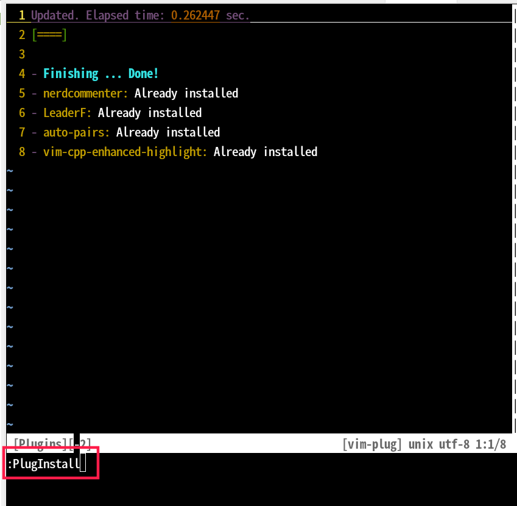

## 安装
0. 依赖安装
```
sudo apt instal ctags global
```

1. 下载 vim_config
```
mkdir ~/.vim
cd ~/.vim
git clone https://github.com/qiushao/vim_config.git
cp -r ~/.vim/vim_config/autoload ~/.vim
```

2. 启用 vim_config
在`~/.vimrc` 文件中添加以下配置，如果 `.vimrc` 不存在，则创建这个文件
```
source ~/.vim/vim_config/qiushao.vim
```

3. 安装 vim 插件
打开 vim 然后在 vim 里面执行 `:PlugInstall` 命令即可安装所有插件



## 配置说明
```
min@470p:~/.vim/vim_config$ tree
.
├── autoload # Plug 插件管理
├── base.vim # 基础配置，比如说显示行号，禁用鼠标，增量搜索等，每个配置都有注释说明
├── plugin.vim # 指定安装哪些插件
├── qiushao.vim # 配置入口，汇总其他配置而已
├── shortcut.vim # 快捷键配置，每个配置都有注释说明
min@470p:~/.vim/vim_config$
```

## 常用功能
以下的这些功能只是最常用的功能，还有更多功能请自行查看各配置文件，及各插件的官方说明。
以下所有快捷键都是指在 vim `命令模式` 下

### 查找所有文件
LeaderF 插件提供的功能，目前配置为 `;,,` 快捷键触发，
在 shortcut.vim 中配置如下
```
nnoremap ,, :Leaderf file --nameOnly<cr>
```

### 在当前文件中查找函数
LeaderF 插件提供的功能，目前配置为 `;ff` 快捷键触发，
在 shortcut.vim 中配置如下
```
nnoremap <leader>ff :Leaderf function --nameOnly<cr>
```

这个功能依赖 ctags 这个命令

### 在所有文件中查找函数
LeaderF 插件提供的功能，目前配置为 `;ft` 快捷键触发，
在 shortcut.vim 中配置如下
```
nnoremap <leader>ft :Leaderf gtags --nameOnly<cr>
```

### 跳转到函数定义
LeaderF 插件提供的功能，目前配置为 `;fd` 快捷键触发，
在 shortcut.vim 中配置如下
```
nnoremap <leader>fd :<C-U><C-R>=printf("Leaderf! gtags -d %s --stayOpen --auto-jump", expand("<cword>"))<CR><CR>
```

### 查找函数/变量引用
LeaderF 插件提供的功能，目前配置为 `;fr` 快捷键触发，
在 shortcut.vim 中配置如下
```
nnoremap <leader>fr :<C-U><C-R>=printf("Leaderf! gtags -r %s --stayOpen --auto-jump", expand("<cword>"))<CR><CR>
```

**注意**
`在所有文件中查找函数`, `跳转到函数定义`, `查找函数/变量引用`,  这三个功能依赖 gtags (global 软件包提供的一个命令) ，目前只能识别 c/c++ 代码，不支持 java 代码。
按目前的设置，需要在代码目录创建 `.vimproject`  空目录，然后 vim 打开任意一个 c/c++ 文件才会生效符号数据库，这个快捷键才能使用。

### 注释
NERDComment 插件提供的功能，目前配置为 `cm` 快捷键触发，
在 shortcut.vim 中配置如下
```
" 注释当前行
nnoremap cm :call NERDComment(0, "toggle")<cr>
```

